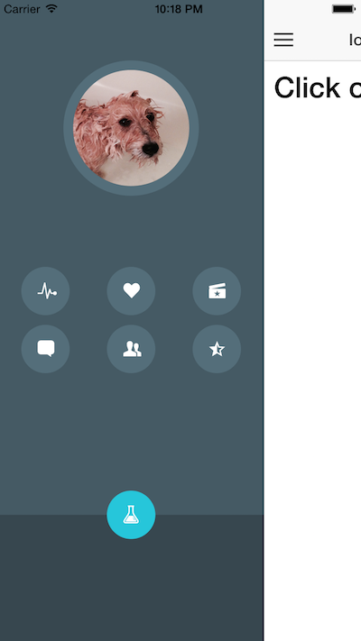

Ionic OkCupid Side Menu
===================

A demo of how to achieve a side menu similar to that of the OkCupid App.
When the side menu is triggered, a ratio is returned via the `$ionicSideMenuDelegate.getOpenRatio()` provider method.
This ratio is then by a callback which is passed to the the animate ratio directive through
the `animate-ratio` ratio.

[Demo](http://codepen.io/loringdodge/pen/YXvGjX)



## Usage

In your sidemenu:
```html
<button class="button-circle" animate-ratio="fadeIn">
  <i class="ion-ios-pulse-strong"></i>
</button>
```

In your parent controller:
```js
var transitionIn = function(ratio) {
  return Math.abs(ratio);
}

$scope.fadeIn = function(element, ratio) {
  element.style.transform = element.style.webkitTransform = 'scale(' + transitionIn(ratio) + ')';
  element.style.opacity = transitionIn(ratio);
}
```

## Directive Attributes

| Name                   | Scope  | Options| Action                                                        |
|------------------------|--------|--------|---------------------------------------------------------------|
| `animate-ratio`        | =      | fn     | Callback used to customize animation                          |


